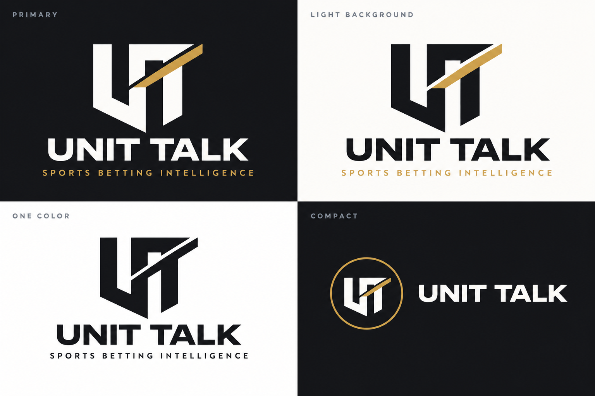

# Unit Talk brand references

Griff requested these assets be retained in Unit Talk V2 on 2026-09-11.

## Assets

- `unit-talk-original-logo-reference.png`: supplied metallic UT monogram reference.
- `unit-talk-flat-logo-concepts.png`: generated refinement sheet showing dark, light, monochrome and compact treatments.

## Intended direction

Angular UT monogram, UNIT TALK wordmark, black/white and warm gold. The descriptor is SPORTS BETTING INTELLIGENCE. DATA • DISCIPLINE • COMMUNITY is optional supporting messaging. Preserve legibility and consistent proportions across Discord, web and marketing.

These PNGs are design references, not final vector masters or a transparent asset pack. The concept sheet retains slight shading and its variants need geometric normalization. Do not label it an SVG, claim the colors have been extracted exactly, or use the entire sheet as an application logo.

Proposed flat palette: near-black #151619, warm gold #C7A34B, soft white #F5F4EF. Final vector production must confirm these colors and use solid fills.

Before public rollout: produce consistent SVG masters, transparent PNG exports, icon-only and horizontal/stacked lockups; verify 32–48 px readability, circle cropping and white-background contrast. Omit descriptors at small sizes. This reference addition does not activate product features or change application branding automatically.
