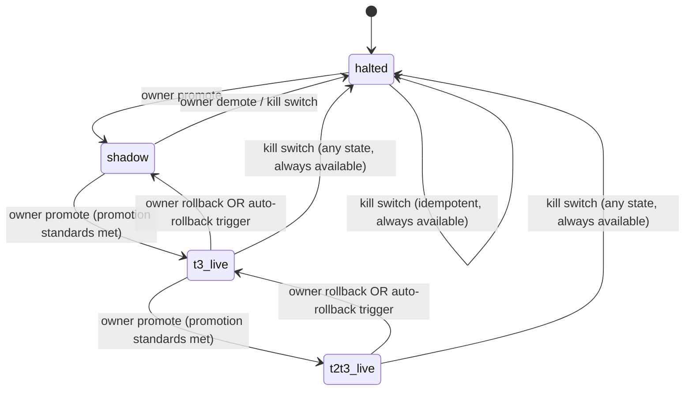
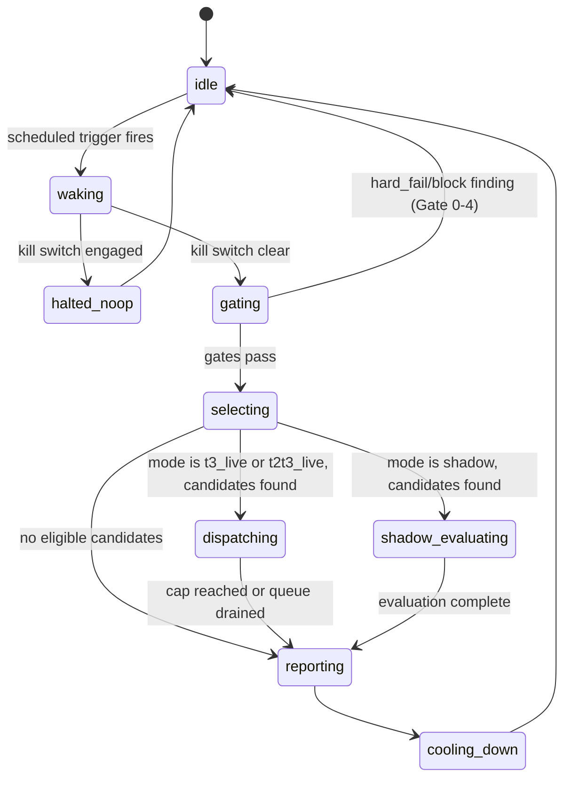

# Autonomy State Machine

**Status:** Canonical contract — AUT-1
**Authority:** This document, plus `MODE_CONTRACT.md` and `KILL_SWITCH_CONTRACT.md`, is the binding spec for
AUT-2's kernel state handling. Code diverging from this document is a bug in the code, not a reinterpretation.
**Program:** Autonomous Delivery Control Plane (AUT-1 .. AUT-6)

---

## 1. Two orthogonal state machines

The autonomy kernel has **two** state machines that must not be conflated:

1. **Mode** — persists across wake cycles, changed only by the owner (Griff) or by a mechanical
   auto-rollback trigger. Answers "what is this system allowed to do at all, right now."
2. **Cycle** — transient, exists only for the duration of a single wake invocation, always starts at
   `idle` and always ends back at `idle` (or the process exits — see `CRASH_RESTART_SEMANTICS.md`).
   Answers "where is the current wake-up in its own lifecycle."

A kernel implementation persists **Mode** (survives restarts) and **must not** persist **Cycle** state as
if it were resumable — an interrupted cycle is reconciled from rank-1/rank-2/rank-3 truth on the next wake,
never resumed from its last in-memory step. See `CRASH_RESTART_SEMANTICS.md` §2.

---

## 2. Mode state machine

### 2.1 States

| State | Meaning |
|---|---|
| `halted` | Kernel takes zero actions of any kind except reading its own state and emitting the one `kernel_halted` audit event on state entry. No dispatch, no merge, no notification evaluation beyond the halt confirmation itself. Default state — a kernel that has never been explicitly promoted starts here. |
| `shadow` | Kernel wakes on schedule, runs the full evaluation pipeline (Gates 0-4, candidate selection, tier/scope checks), and **logs what it would have dispatched/merged** to the audit log and a shadow-decision record. It takes **zero** mutating actions — no `ops:lane-start`, no PR open, no merge, no Linear write. |
| `t3_live` | Kernel may autonomously dispatch and merge **T3-tier only** work, using the exact same mechanical gates and merge authority a human-invoked `/dispatch` already uses for T3 (green CI + valid executor result, no PM verdict — `EXECUTION_TRUTH_MODEL.md` §4). |
| `t2t3_live` | Kernel may autonomously dispatch and merge **T2 and T3** tier work, using the exact same T2 merge authority (`gh pr review --approve` after diff review, or `pm-verdict/v1`) a human-invoked orchestrator already uses. |

There is **no** `t1_live` state and no state in which the kernel can dispatch, plan, or merge T1 work. This
is not an omission — see `AUTHORITY_MATRIX.md` §1 and `T1_QUEUE_BEHAVIOR.md`. T1 authority is never granted
to this system under any mode, permanently, by design.

### 2.2 Transition diagram

### 2.3 Transition table

| From | To | Trigger | Actor | Automatic? |
|---|---|---|---|---|
| `halted` | `shadow` | explicit promotion | owner only | No |
| `shadow` | `halted` | explicit demotion, or kill switch | owner | No (demotion) / Yes (kill switch, mechanically instant) |
| `shadow` | `t3_live` | promotion decision (`PROMOTION_ROLLBACK_STANDARDS.md` §1) | owner only | No |
| `t3_live` | `shadow` | rollback trigger fires | owner or kernel (auto-rollback only) | Owner: no. Kernel: yes, for defined triggers only. |
| `t3_live` | `t2t3_live` | promotion decision | owner only | No |
| `t2t3_live` | `t3_live` | rollback trigger fires | owner or kernel (auto-rollback only) | Owner: no. Kernel: yes, for defined triggers only. |
| any state | `halted` | kill switch engaged | owner | Yes, mechanically instant per `KILL_SWITCH_CONTRACT.md` |

**Invariants:**
- **Promotion is always owner-only and never automatic.** The kernel has no code path that raises its own
  mode. This is the single most important asymmetry in this contract (see `PROMOTION_ROLLBACK_STANDARDS.md`
  §4).
- **Rollback (moving down exactly one step) may be kernel-initiated** for a fixed, enumerated set of
  triggers (`PROMOTION_ROLLBACK_STANDARDS.md` §2). A kernel-initiated rollback always moves down exactly
  one step (`t2t3_live` → `t3_live`, or `t3_live` → `shadow`) — it never skips to `halted` on its own
  authority; only the kill switch (owner-controlled, or the kernel's own hard-auto-halt conditions defined
  in `LIMITS.md`) reaches `halted`.
- **The kill switch is reachable from every state, including mid-transition**, and is idempotent (`halted`
  → `halted` on repeat trigger is a no-op, not an error).
- There is no reachable state that grants T1 authority. This is enforced both here (no such state exists in
  the enum) and independently in the dispatch packet schema (`schemas/dispatch_packet_v1.schema.json`,
  `tier` enum has no `T1` value).

---

## 3. Cycle state machine (per wake invocation)

### 3.1 States

| State | Meaning |
|---|---|
| `idle` | Not currently executing a cycle. Entry and exit state. |
| `waking` | Process started; reading persisted kernel state, checking the kill switch (first mechanical action of every invocation — see `KILL_SWITCH_CONTRACT.md` §2), reconciling any interrupted prior cycle. |
| `gating` | Running Gate 0-4 (`ops:substrate-guard`, `ops:merge-risk`, `ops:execution-state`, `ops:lane-maximizer`, `ops:orchestration-reconcile`) — the same gates `/dispatch` and `/loop-dispatch` already run for session-invoked dispatch (`COMPATIBILITY_MAP.md`). |
| `selecting` | Building the T2/T3-only candidate queue (T1 structurally excluded — `T1_QUEUE_BEHAVIOR.md` §1), applying sensitive-path and tier checks (`THREAT_MODEL.md` #3). |
| `dispatching` | Executing dispatch/merge actions for selected candidates, up to `LIMITS.md`'s per-cycle cap, one candidate at a time, each independently idempotency-keyed (`CRASH_RESTART_SEMANTICS.md` §3). Skipped entirely in `shadow` mode — see below. |
| `shadow_evaluating` | `shadow`-mode-only equivalent of `dispatching`: same selection output, zero mutating calls, decisions written to the shadow-decision log. |
| `reporting` | Writing cycle summary to the kernel's own execution-state record and audit log; evaluating `NOTIFICATION_TAXONOMY.md` triggers. |
| `cooling_down` | Enforced minimum gap before the next scheduled trigger is allowed to start a new cycle (mechanical concurrency-group serialization — `LIMITS.md` §1, `COMPATIBILITY_MAP.md`). |
| `idle` | Cycle complete; returns to entry state. |

### 3.2 Diagram

**Every arrow in the cycle diagram is either a mechanical gate result or a mode check — never a narrative
judgment.** `gating` failing is a hard stop for the whole cycle (fail closed, not "proceed cautiously").

---

## 4. Compatibility note

This state machine does **not** replace or duplicate the existing **lane manifest lifecycle**
(`LANE_MANIFEST_SPEC.md` §2: Ready → Started → In Progress → In Review → Merged → Done) or the
**Execution Truth Model lane lifecycle** (`EXECUTION_TRUTH_MODEL.md` §2). Those govern a single lane's
life. This document governs the **kernel's own** mode and per-wake execution — one level up. A single
`dispatching` cycle step may create, progress, and close zero or more individual lanes, each still fully
governed by the existing lane lifecycle unchanged.
