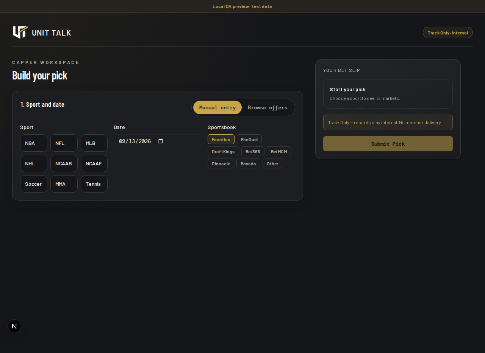
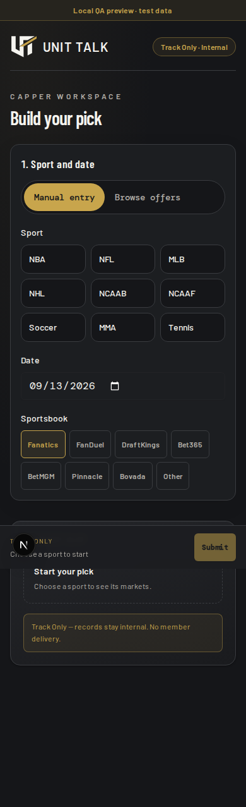

# UTV2-1895 Smart Form verification

## Summary

Implementation reviewed at `e8a2048d22b59652c03ea5672e7db028e05aaf8e`, relative to base `4ac23bad57aa3435fd099cdb24f4d64b722bcefe`, on 2026-09-13. This proof-only addition changes no runtime behavior. The recovered lane remains owned by Codex; PR #1573 remains a draft. No owner or merge approval is claimed.

Manual entry is the default. The flat application logo, responsive slip, schema-derived incomplete state, preserved error values, synchronous in-flight lock and saved receipt are implemented in the existing frontend. Later retries/repeats defer to existing server idempotency. The QA/test-data banner remains visible.

## Verification

- `pnpm verify` was executed locally. Its complete `verify:static` chain passed: boundary/alignment/env/lint/type/build/local tests, 170 Smart Form unit tests and command/migration checks. The overall command exited 1 when `pnpm test:db` reached the staging-target guard; the unidentified local target was refused before writable tests. This is not a green full gate.
- `pnpm --filter @unit-talk/smart-form build` passed with an explicitly local build-only auth secret. No deployment followed.
- `pnpm exec tsx --test apps/api/src/submission-service.test.ts` passed 96 tests.
- Browser regression plus focused reruns passed 37 distinct cases. One existing real-reference test skipped because its LeBron fixture is absent. The last affected rerun passed 13/13 cases.
- The connected local NFL case covers Chiefs/Bills canonical participants, signed spread/odds, 503 recovery with values retained, overlapping-request exclusion, a later repeat reaching the API and returning the same pick ID, capper attribution, persisted pick details and zero outbox records.
- Four offline cases cover moneyline, negative spread, total-under and passing-yards-over through the shared slip. They use explicitly synthetic fixtures and block nonlocal requests; they do not establish live SGO coverage.
- Manual default, explicit browse opt-in, disabled initial submit and zero horizontal overflow passed at 1280, 390 and 320 pixels. Inspection of the visible Next.js development menu found no current issue row, console/page error or runtime overlay. The development badge was not hidden.
- Local QA-agent experience and R-level compliance passed. The QA experience is a control-presence check; the connected browser cases carry the submission/persistence evidence.
- Fresh independent review found no introduced correctness/security defects and independently passed 198 local tests. Its one whitespace finding was corrected. The reviewer verified the final delta and rebound the report to the implementation SHA above; see `independent-review.md`.

## Evidence

Exact TAP excerpt from the Smart Form **local unit phase** inside the executed `pnpm verify` log (not an aggregate full-gate or database result):

```text
1..112
# tests 170
# suites 16
# pass 170
# fail 0
# cancelled 0
# skipped 0
# todo 0
# duration_ms 2170.154917
```

Included desktop/mobile screenshots are actual captures from the local QA preview on port 4411, with an isolated in-memory API on port 4401. They do not prove real Google authentication, current NFL rosters, durable production storage or staging browser behavior.





Complete local logs and supplementary 320px/slip/receipt captures remain in `.out/smart-form-preview/finishing/` and `.out/smart-form-preview/` in the recovered worktree. Reference-data proposals remain non-executable review artifacts; no production data was changed.

The local full-command refusal was:

```text
[assert-staging] host=127.0.0.1 ref=unidentified expected=xskgrzbteyqdufktjrjx
[assert-staging] REFUSED: target identity could not be resolved from its URL (host=127.0.0.1). Writable DB verification requires xskgrzbteyqdufktjrjx.
```

## Pre-merge staging verification

Griff authorized a one-time pre-PR ordering exception for UTV2-1895: open this draft using completed local/static evidence solely to invoke the unchanged full staging CI. No tests, proof, independent review or merge approval were waived. No deployment, production access, SGO access, credential movement or new workflow was authorized.

Current-head full verification must come from the existing CI workflow: static verification, approved-staging `pnpm test:db`, `pnpm test:t1-proof:live`, and same-run CI receipt auditing. Read the live checks on [PR #1573](https://github.com/griff843/Unit-Talk-v2/pull/1573) and the final-head review packet; this document does not predeclare their outcomes. Failed or cancelled older-head runs are not accepted as final-head evidence.

Historical only: [run 34765611499](https://github.com/griff843/Unit-Talk-v2/actions/runs/34765611499) passed seven staging smoke tests and its auditor at `b4d7a8c4eb668a2f084fbe4d0d724bd0aca210d5`. It is neither final-head proof nor full T1 proof. Production and SGO remain unchanged.
